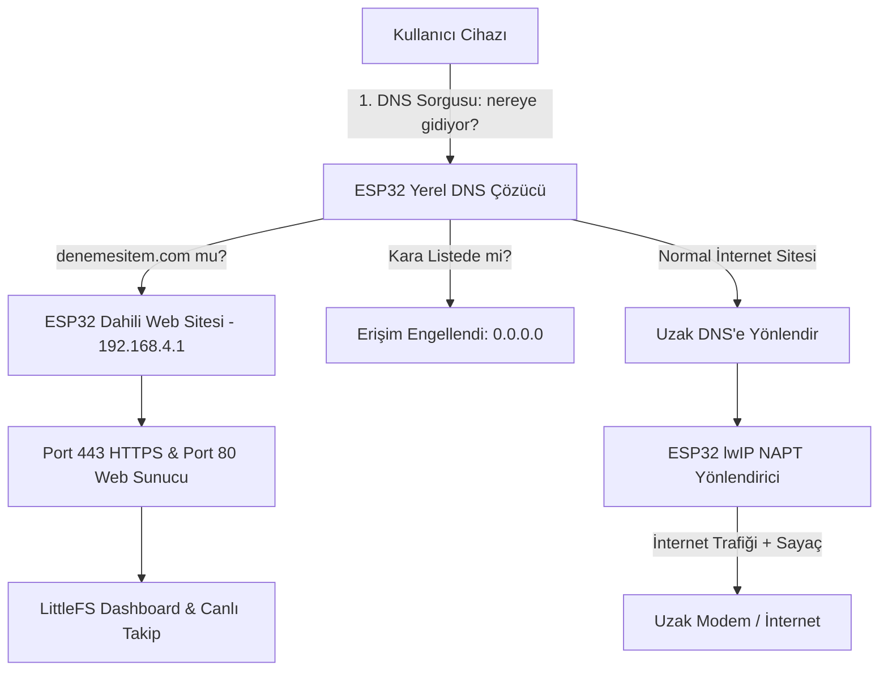

# ESP32 NAT Router, DNS Sinkhole & HTTPS Web Server

ESP32 (NodeMCU / ESP-WROOM-32) üzerinde çalışan; uzak bir Wi-Fi modeme bağlanarak interneti yerel kullanıcılara dağıtan (Wi-Fi Range Extender / NAT Router), gelen trafiği filtreleyip izleyen (DNS Sinkhole / Firewall) ve özel alan adı (`denemesitem.com`) ile Port 443 (HTTPS) üzerinden dahili yönetim arayüzü sunan gelişmiş bir IoT ağ geçidi projesidir.

---

## 🌟 Temel Özellikler

1. **Wi-Fi Range Extender & NAT Router (AP + STA):**
   * Uzak modeme Wi-Fi istemcisi (STA) olarak bağlanır.
   * Yakındaki kullanıcılar için kendi yerel Wi-Fi ağını (SoftAP) yayınlar.
   * lwIP `IP_NAPT` donanımsal/yazılımsal yönlendirmesi ile bağlı cihazlara internet erişimi sağlar.

2. **Özel Alan Adı Yönlendirmesi (Split-Horizon DNS):**
   * Kullanıcılar tarayıcıya `denemesitem.com` yazdığında istek yerel DNS sunucusu tarafından yakalanır ve doğrudan ESP32'nin yerel IP'sine (`192.168.4.1`) yönlendirilir.
   * Diğer tüm web siteleri için internet kesintisiz çalışmaya devam eder.

3. **Port 443 (HTTPS) & Port 80 Dahili Web Sunucusu:**
   * mbedTLS şifrelemesi ve SSL/TLS sertifikası ile güvenli bağlantı.
   * LittleFS dosya sistemi üzerinde modern, responsive ve harici CDN'e bağımlı olmayan web yönetim paneli.

4. **Trafik İzleme ve İstatistik Motoru:**
   * Bağlı istemcilerin (IP, MAC) anlık veri kullanımı (Upload / Download).
   * WebSocket üzerinden canlı ağ trafiği ve anlık hız (kbps/Mbps) grafikleri.

5. **İçerik Filtreleme ve Güvenlik Duvarı (DNS Sinkhole):**
   * Dahili Port 53 DNS sunucusu üzerinden sorgu denetimi.
   * Kara liste (Blacklist) yönetimi ile istenmeyen alan adlarını (sosyal medya, bahis, yetişkin içerik vb.) engelleme.
   * Tek tıkla istenmeyen cihazların internet erişimini kesme (Kick/Ban).

---

## 🏗️ Mimari Şema



---

## 🚀 Proje Yol Haritası

- [ ] **Aşama 1:** Wi-Fi AP + STA ve lwIP NAPT Router çekirdeği.
- [ ] **Aşama 2:** DNS Proxy, `denemesitem.com` yerel çözümlemesi ve DNS Sinkhole (Blacklist filtreleme).
- [ ] **Aşama 3:** Cihaz bazlı trafik sayacı ve bellek korumalı halka log motoru (Ring Buffer).
- [ ] **Aşama 4:** Port 443 HTTPS web sunucusu ve LittleFS dosya sistemi entegrasyonu.
- [ ] **Aşama 5:** Modern, responsive Web Dashboard (Canlı trafik izleme, Wi-Fi ayar ekranı, kural yönetimi).
- [ ] **Aşama 6:** Kararlılık, hafıza optimizasyonu ve Auto-Reconnect mekanizması.

---

## 📦 Kurulum ve Geliştirme

Proje **VS Code + PlatformIO** ortamı hedeflenerek tasarlanmıştır.

1. Depoyu klonlayın:
   ```bash
   git clone https://github.com/fatihdeveci05-creator/esp32router.git
   ```
2. VS Code ile klasörü açın.
3. PlatformIO eklentisi ile derleyin ve ESP32 kartınıza yükleyin.
